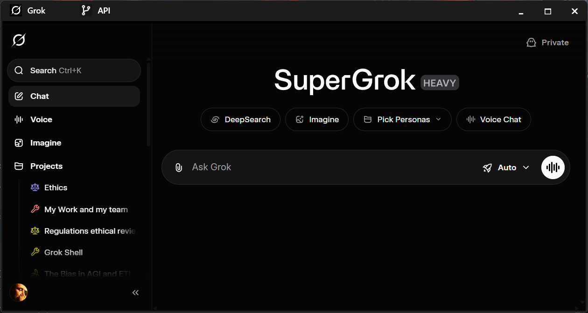

# GrokUI

GrokUI is a WPF application that hosts grok in a webview so you can easily pin grok to your taskbar and launch it separately without being a tab in your browswer.
## Features
- Pin grok to your taskbar
- Launch grok in a separate window
- Persistent user data for cookies and login
- Remembers size and position between sessions
- Title bar buttons to navigate between grok chat and xAI API playground

